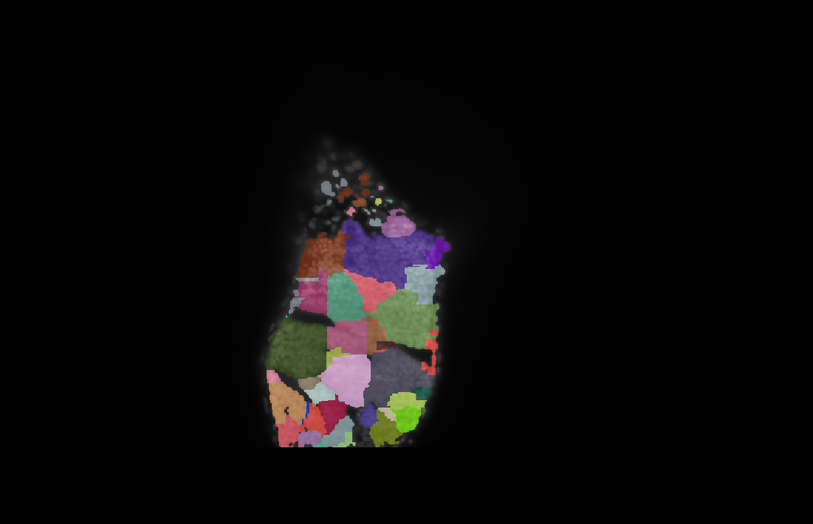
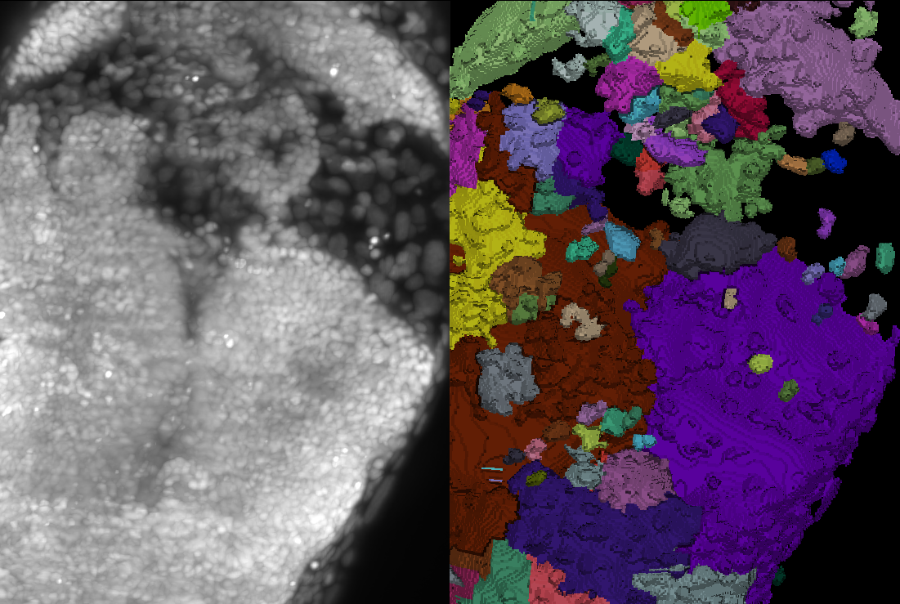
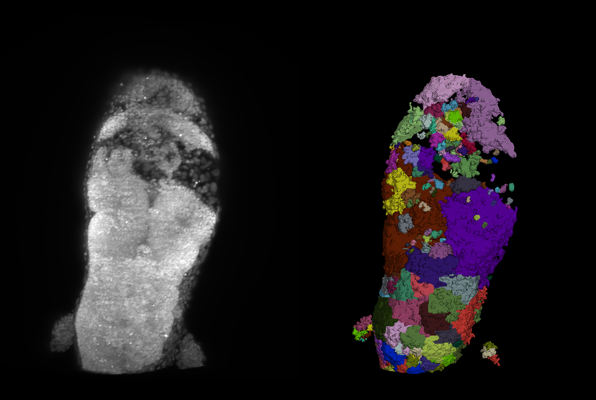

# 🧬 Zebrafish-MorphoPro: Quantitative 3D Phenotyping Suite

[](https://www.python.org/downloads/)
[](https://share.streamlit.io/)
[](https://opensource.org/licenses/MIT)

## 🔬 Project Overview
This repository contains a specialized computational pipeline for the **3D morphometric analysis of Cdh2-CRISPR zebrafish embryos**. By integrating high-resolution confocal microscopy with automated segmentation and statistical modeling, this tool quantifies the relationship between cell-cell adhesion loss and nuclear architecture.

### Key Biological Question
Does the perturbation of *Cadherin-2 (Cdh2)*—a critical cell-cell adhesion molecule—lead to predictable changes in nuclear volume and spatial packing?

---

## 📊 Visual Analysis Portfolio

| 1. 3D Reconstruction | 2. Phenotype Detail |
| :---: | :---: |
|  |  |
| *Full 3D volumetric segmentation of the embryonic midline.* | *Zoomed view of nuclear hypertrophy in Cdh2-CRISPR regions.* |

| 3. Segmentation Validation | 4. Spatial Distribution |
| :---: | :---: |
|  |  |
| *Overlay of raw confocal data vs. computational labels.* | *Whole-tissue mapping of the segmented nuclear population.* |


---

## 🚀 Technical Features

### 1. 3D Segmentation Engine (`Napari` & `scikit-image`)
- **Automated Labeling:** Converts raw TIF stacks into unique 3D objects.
- **Validation:** High-fidelity overlap between raw fluorescence intensity and computational masks (see Fig 3).
- **Morphometry:** Extraction of 3D Centroids, Volumetric Data (voxels), and Sphericity.

### 2. Interactive Analysis Dashboard (`Streamlit`)
- **Real-time Filtering:** Dynamic Z-slice depth isolation to study specific tissue layers.
- **Statistical Modeling:** Automated calculation of **Nearest Neighbor Distance (NND)**.
- **Correlation Analysis:** Identified a strong positive correlation (**$r = 0.61$**) between nuclear volume and tissue sparsity.

## 📈 Key Findings
Our analysis of the **S-BIAD1405** dataset (BioImage Archive) demonstrates that *Cdh2* deficiency triggers significant **nuclear hypertrophy**. The observed correlation ($r = 0.61$) suggests that enlarged nuclei are associated with increased inter-nuclear spacing, indicating a breakdown in the mechanical tension and cohesive packing of the embryonic tissue.

## 🛠️ Installation & Usage
1. **Clone the repository:**
   ```bash
   git clone https://github.com/YOUR_USERNAME/Zebrafish-MorphoPro.git
