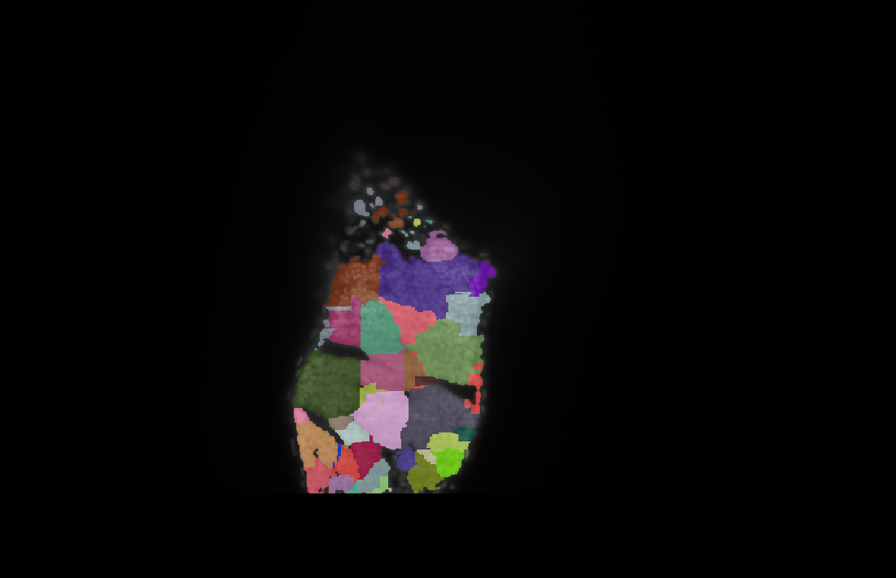
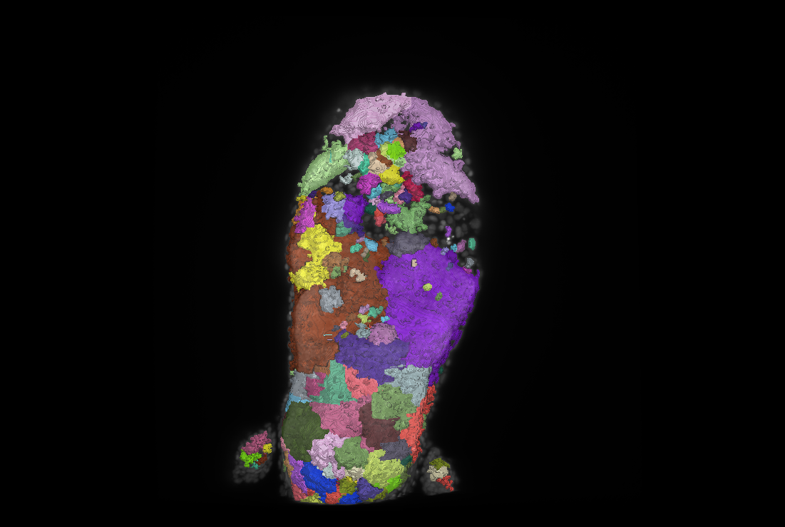
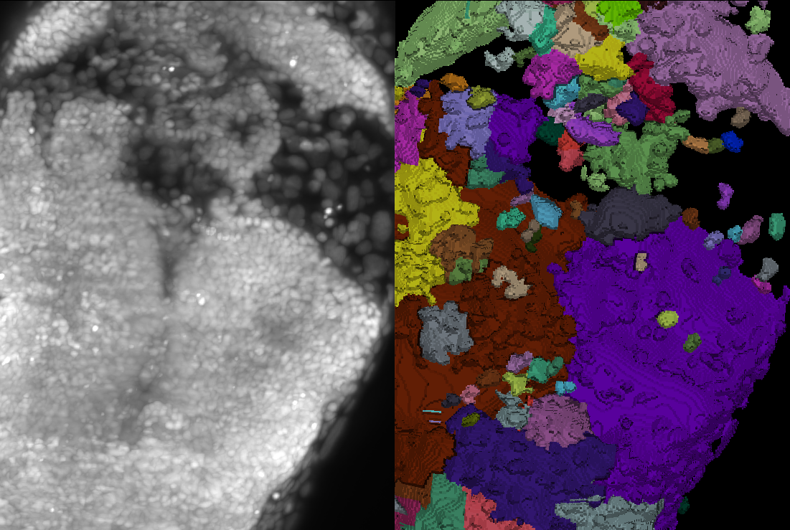
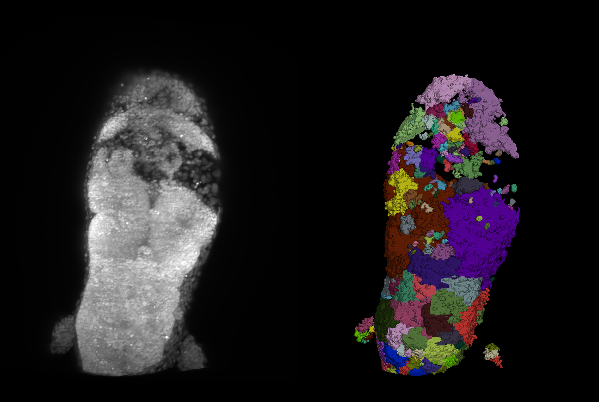

# 🧬 Zebrafish-MorphoPro: Quantitative 3D Phenotyping Suite

[](https://www.python.org/downloads/)
[](https://zebrafish-3d-morphometry-suite-yash.streamlit.app/)
[](https://opensource.org/licenses/MIT)
[](https://github.com/YASH4-HD/Zebrafish-3D-Morphometry-Suite-yash/graphs/commit-activity)

## 🔬 Project Overview
This repository contains a specialized computational pipeline for the **3D morphometric analysis of *Cdh2*-CRISPR zebrafish embryos**. By integrating high-resolution confocal microscopy with automated segmentation and statistical modeling, this tool quantifies the relationship between cell-cell adhesion loss and nuclear architecture.

### Key Biological Question
Does the perturbation of *Cadherin-2 (Cdh2)*—a critical cell-cell adhesion molecule—lead to predictable changes in **nuclear morphometry** and **spatial packing density**?

---

## 📊 Visual Analysis Portfolio

| 1. 3D Reconstruction | 2. Phenotype Detail |
| :---: | :---: |
|  |  |
| *Full 3D volumetric segmentation of the embryonic midline.* | *Zoomed view of nuclear hypertrophy in Cdh2-CRISPR regions.* |

| 3. Segmentation Validation | 4. Spatial Distribution |
| :---: | :---: |
|  |  |
| *Overlay of raw confocal data vs. computational labels.* | *Whole-tissue mapping of the segmented nuclear population.* |

---

## 🚀 Technical Features

### 1. 3D Segmentation Engine (`Napari` & `scikit-image`)
- **Automated Labeling:** Converts raw TIF stacks into unique 3D objects using watershed and thresholding algorithms.
- **Validation:** High-fidelity overlap between raw fluorescence intensity and computational masks.
- **Morphometry:** Extraction of 3D Centroids, Volumetric Data (voxels), and Sphericity.

### 2. Interactive Analysis Dashboard (`Streamlit`)
- **Real-time Filtering:** Dynamic Z-slice depth isolation to study specific tissue layers (e.g., Notochord vs. Neural Tube).
- **Statistical Modeling:** Automated calculation of **Nearest Neighbor Distance (NND)** to quantify tissue packing.
- **Correlation Analysis:** Identified a strong positive correlation (**r = 0.61**) between nuclear volume and tissue sparsity.

## 📈 Key Findings
Analysis of the **S-BIAD1405** dataset (BioImage Archive) demonstrates that ***cdh2*** deficiency triggers significant **nuclear hypertrophy** (91.9% volume increase). The observed correlation (**r = 0.61**) suggests that enlarged nuclei are associated with increased inter-nuclear spacing, indicating a breakdown in the mechanical tension and cohesive packing of the embryonic tissue.

---

## 🛠️ Installation & Usage

1. **Clone the repository:**
   ```bash
   git clone https://github.com/YASH4-HD/Zebrafish-3D-Morphometry-Suite-yash.git
   cd Zebrafish-3D-Morphometry-Suite-yash


2. **Install dependencies:**
   pip install -r requirements.txt

3. **Launch the Dashboard:**
   streamlit run app.py

---
## 📜 Citation
If you use this suite in your research, please cite it as:
Nama, Y. (2026). Zebrafish-MorphoPro: Quantitative 3D Phenotyping Suite (Version 1.0.0). 
GitHub. https://github.com/YASH4-HD/Zebrafish-3D-Morphometry-Suite-yash

---
## 👨‍🔬 Author
**Yashwant Nama**  
*PhD Applicant | Molecular Biologist & Computational Researcher*  
**Focus:** Quantitative Developmental Biology, Mechanobiology, and Reproducible Bioinformatics.


